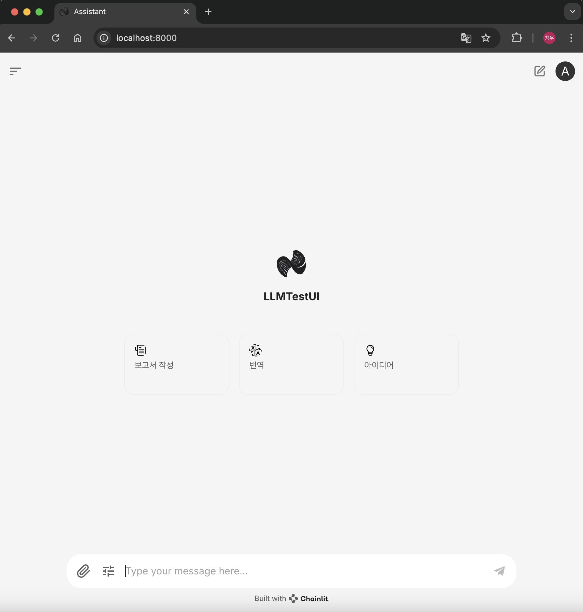
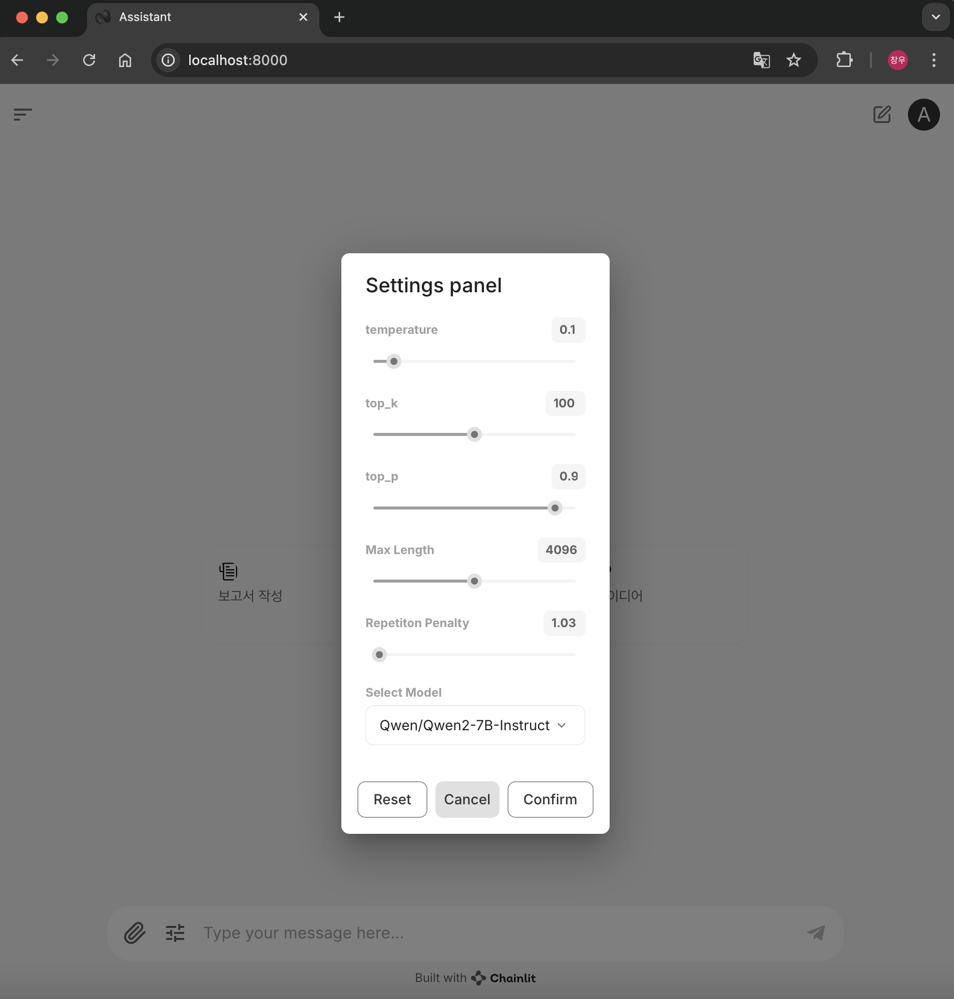
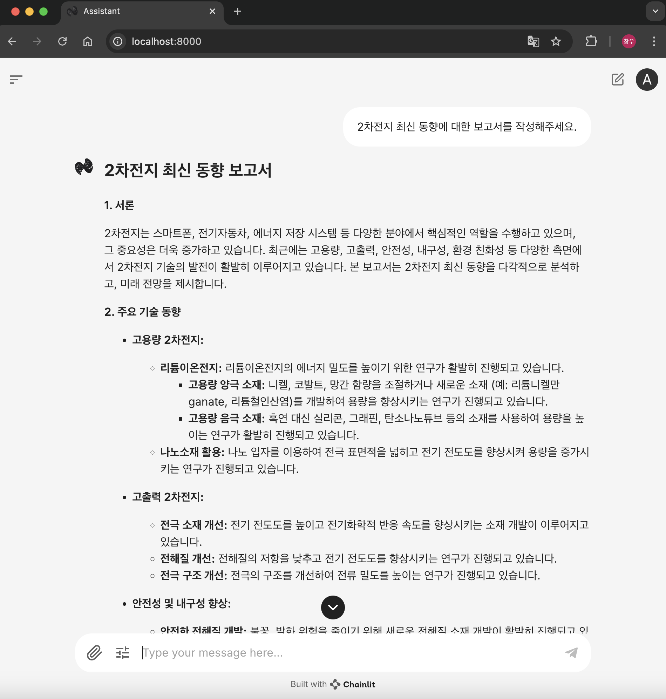
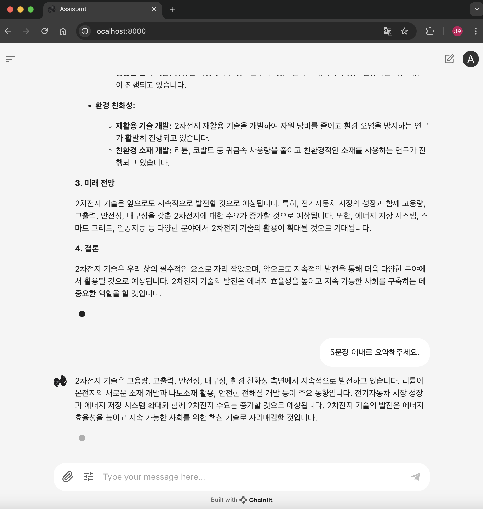

# 📌 with Chainlit
# LLM Testing UI

This project is a UI developed for testing and comparing the performance of multiple large language models (LLMs). 
The interface is designed to support evaluation of different models' outputs using **Chainlit** as the backend for generating model responses.

## Models Included
The UI is configured to test the following models:
1. **Qwen/Qwen2-7B-Instruct**
2. **Meta-Llama/Meta-Llama-3.1-8B-Instruct**
3. **Google/Gemma-2-9B-IT**

## Features
This LLM Testing UI includes belows
1. Single-Turn
2. Multi-Turn
3. Select Hyper-parameter (temperature, top-p, ... etc)

## Snapshots
#### 1. Main Page

#### 2. Settings

#### 3. Single Turn

#### 4. Multi Turn

